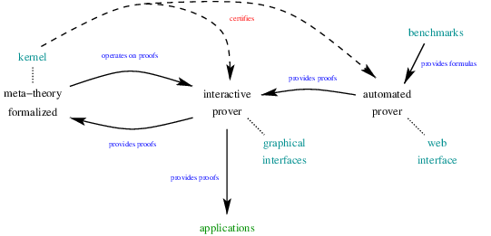

# CALLManifesto
**Description of the Computer Aided Linear Logic project and its components**

We aim at developing a family of tools for manipulating linear logic (proofs) on a computer.
These tools should be able to interact in order to provide the richest possible linear logic environment. This relies on some common representations of formulas, proofs, etc.

Here are some examples of such interactions:

## [Click and Collect](https://github.com/ComputerAidedLL/click-and-collect)
*categories: interactive prover / graphical interface*

Web-based interactive theorem prover for linear logic. It includes some automated features, export to `NanoYalla` kernel and other formats, proof transformations (cut elimination, axiom expansion, etc.).

## [LL Keyboard](https://github.com/ComputerAidedLL/LLKeyboard)
*categories: tool / interface*

Keypad configuration files to get direct access to UTF-8 linear-logic-related symbols.

## [Yalla](https://github.com/olaure01/yalla)
*categories: formalization, kernel*

A [Coq](https://coq.inria.fr/) formalization (deep embedding) of Linear Logic.
It includes `NanoYalla`, a kernel formalization.

## Related projects (preliminary list)
**Natural candidates for integration in the CALL framework**

### [LLTP](https://github.com/meta-logic/lltp)
*categories: benchmark*

Collection of classical and intuitionistic linear logic formulas to be used as a benchmark for provers.

### [Sympli](https://github.com/chaudhuri/sympli)
*categories: automated prover*

A focused automated theorem prover for linear logic.

### [Linear-Logic-Prover-in-Maude](https://github.com/carlosolarte/Linear-Logic-Prover-in-Maude)
*categories: automated prover*

A focused automated theorem prover for linear logic.

### [APLL](https://github.com/wujuihsuan2016/LL_prover)
*categories: automated prover*

A focused automated theorem prover for linear logic.

### [Profound](https://github.com/chaudhuri/profound)
*categories: interactive prover*

Interactive proof construction by linking.

